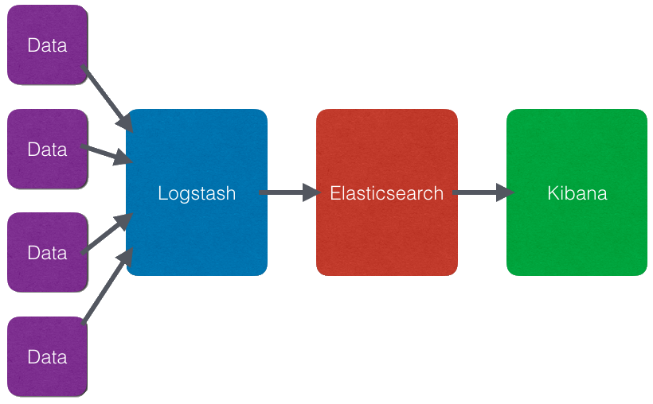
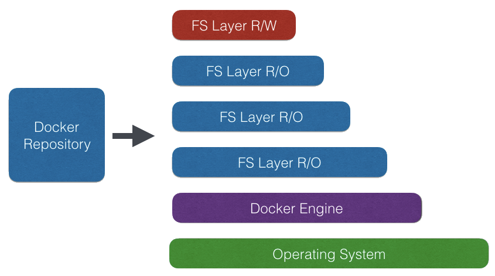
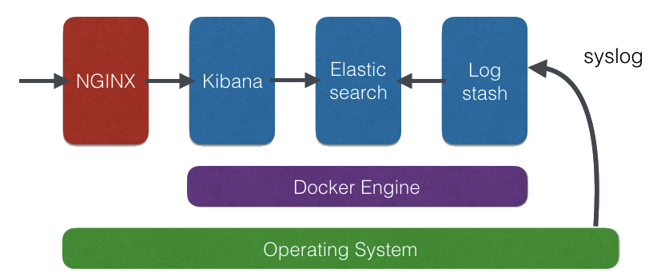

# ELK Stack on Docker within minutes

Talk @ elasticserach usergroup vienna [Log management with Logstash, Elasticsearch, and Kibana](http://www.meetup.com/Elastic-Usergroup-Vienna/events/225776271/)

## What’s ELK?

[https://www.elastic.co](https://www.elastic.co)

* Elasticsearch - Search and analyze data
* Logstash - Collect, enrich, and transport data
* Kibana - Explore and visualise

## ELK Dataflow

Data is collected, enriched by Logstash and indexed within Elasicsearch. Kibana accesses the data stored within Elasticsearch and visualises it with a Single Page WebApp.



## What’s Docker?

[https://www.docker.com](https://www.docker.com)

* High level API lightweight Linux containers
* Package format with all dependencies
* Layerd File System

It consiststs of  the following building blocks
* Docker Engine - server process
* Docker CLI - command line interface to conrol the server
* Docker Repository - stores prepared docker images

Within the layerd filesystem all layers are read only except for the top layer.
Layers can be stored within the repository and cached locally.



## Snowflake vs. Phoenix Server

[http://martinfowler.com/bliki/PhoenixServer.html](http://martinfowler.com/bliki/PhoenixServer.html)

### Snowflake Server

* Install Java (as ELK is JVM based)
* Download ELK binaries
* configure
* Set up services

* [https://www.elastic.co/products/logstash](https://www.elastic.co/products/logstash)
* [https://www.elastic.co/products/elasticsearch](https://www.elastic.co/products/elasticsearch)
* [https://www.elastic.co/products/kibana](https://www.elastic.co/products/kibana)

But what about updates?

### Phoenix Server

* Use official Docker packages
* configure



Updates are simple, just throw away server, run new version from repository

[https://hub.docker.com](https://hub.docker.com)

## ELK Phoenix Server on Docker

* Grab Ubuntu 16.04 box from [https://cloud.digitalocean.com](https://cloud.digitalocean.com)
* Install Firewall & Frontend NGINX Proxy
* Install Docker
* Install ELK on Docker from official repository
* Feed syslog to ELK



### Update system
```
apt-get -y update
apt-get -y upgrade
```

### Install Firewall
```
ufw status
ufw default deny incoming
ufw default allow outgoing
ufw allow ssh
ufw allow 80/tcp
ufw --force enable
```

### Install Docker

[https://docs.docker.com/installation/ubuntulinux/](https://docs.docker.com/installation/ubuntulinux/)

```
wget -qO- https://get.docker.com/ | sh
```

### Install ELK folder structure on host
```
mkdir -p /var/docker/elasticsearch
mkdir -p /var/docker/logstash
chmod -R uga+rwX /var/docker
```

### create logstash config
```
cat >/var/docker/logstash/syslog.conf <<'EOL'
input {
  tcp {
    port => 25826
    type => syslog
  }
  udp {
    port => 25826
    type => syslog
  }
}
 
filter {

 if [type] == "syslog" {
    grok {
      match => { "message" => "<%{POSINT:syslog_pri}>%{SYSLOGTIMESTAMP:syslog_timestamp} %{SYSLOGHOST:syslog_hostname} %{DATA:syslog_program}(?:\[%{POSINT:syslog_pid}\])?: %{GREEDYDATA:syslog_message}" }
    }
  }
  if "docker/" in [program] {
    mutate {
      add_field => {
        "container_id" => "%{program}"
      }
    }
    mutate {
      gsub => [
        "container_id", "docker/", ""
      ]
    }
    mutate {
      update => [
        "program", "docker"
      ]
    }
  }
}
 
output {
  elasticsearch {
    hosts => ["db"]
  }
}
EOL
```

### Create isolated network for ELK components
```
docker network create --driver bridge isolated_elk
```

### Install ELK stack on docker
```
docker run -d --restart=always -v /var/docker/elasticsearch:/usr/share/elasticsearch/data --net=isolated_elk -p 127.0.0.1:9200:9200  -p 127.0.0.1:9300:9300 --name elasticsearch elasticsearch:2.3.2

docker run -d --restart=always --link elasticsearch --net=isolated_elk -p 127.0.0.1:5601:5601 --name kibana kibana:4.5.1

docker run -d --restart=always --link elasticsearch:db -v /var/docker/logstash:/conf --net=isolated_elk -p 127.0.0.1:25826:25826 --name logstash logstash:2.3.2-1 logstash -f /conf/syslog.conf
```

### Check isolated ELK network
```
docker network inspect isolated_elk
```

### Check if ELK is runnung
```
docker ps
```

### Install nginx and forward to Kibana

```
apt-get -y install nginx
```
#### password-protect Kibana

```
apt-get -y install apache2-utils
htpasswd -c /etc/nginx/.htpasswd ops
```

```
cat >/etc/nginx/sites-available/default <<'EOL'
server {
  listen 80 default_server;
  listen [::]:80 default_server ipv6only=on;

  root /usr/share/nginx/html;
  index index.html index.htm;

  server_name docker-elk;

  location / {
    try_files $uri $uri/ =404;
  }

  location ~* /.* {
    auth_basic "Restricted";
    auth_basic_user_file /etc/nginx/.htpasswd;
    
    rewrite ^/(.*) /$1 break;

    proxy_pass http://127.0.0.1:5601;
    proxy_set_header Host $host;
    proxy_set_header X-Forwarded-For $proxy_add_x_forwarded_for;
  }
}
EOL

service nginx restart
```

### Create rsyslog config
```
sudo cat >/etc/rsyslog.d/10-logstash.conf <<'EOL'
*.* @@127.0.0.1:25826
EOL
```

### Restart rsyslog
```
service rsyslog restart
```

### Access kibana 

[http://ip-of-server/](http://ip-of-server/)

### Log to syslog
```
logger -s -p 1 "This is fake error..."
logger -s -p 1 "This is another fake error..."
logger -s -p 1 "This is one more fake error..."
```

### Log docker to syslog
```
docker run --log-driver syslog ubuntu echo "Test"
```

## topbeat

Topbeat [https://www.elastic.co/guide/en/beats/topbeat/1.2/index.html](https://www.elastic.co/guide/en/beats/topbeat/1.2/index.html) collects server statistics and feeds them into logstash.

### Install topbeat

```
curl -L -O https://download.elastic.co/beats/topbeat/topbeat_1.2.3_amd64.deb
sudo dpkg -i topbeat_1.2.3_amd64.deb
```

### Load the topbeat template into Elasticsearch
```
git clone https://github.com/elastic/beats.git
```
```
curl -XPUT 'http://localhost:9200/_template/topbeat' -d@beats/topbeat/topbeat.template.json
```

### Add index and dashboard to Kibana

```
curl -XPUT http://localhost:9200/.kibana/index-pattern/topbeat-* -d @beats/topbeat/etc/kibana/index-pattern/topbeat.json || exit 1
echo

for file in beats/topbeat/etc/kibana/search/*.json
do
    NAME=`basename ${file} .json`
    curl -XPUT http://localhost:9200/.kibana/search/${NAME} -d @${file} || exit 1
    echo
done

for file in beats/topbeat/etc/kibana/visualization/*.json
do
    NAME=`basename ${file} .json`
    curl -XPUT http://localhost:9200/.kibana/visualization/${NAME} -d @${file} || exit 1
    echo
done

for file in beats/topbeat/etc/kibana/dashboard/*.json
do
    NAME=`basename ${file} .json`
    curl -XPUT http://localhost:9200/.kibana/dashboard/${NAME} -d @${file} || exit 1
    echo
done
```

### Start Topbeat
```
service topbeat start
```

### Optional - Configure Topbeat
```
vi /etc/topbeat/topbeat.yml
service topbeat restart
```   


